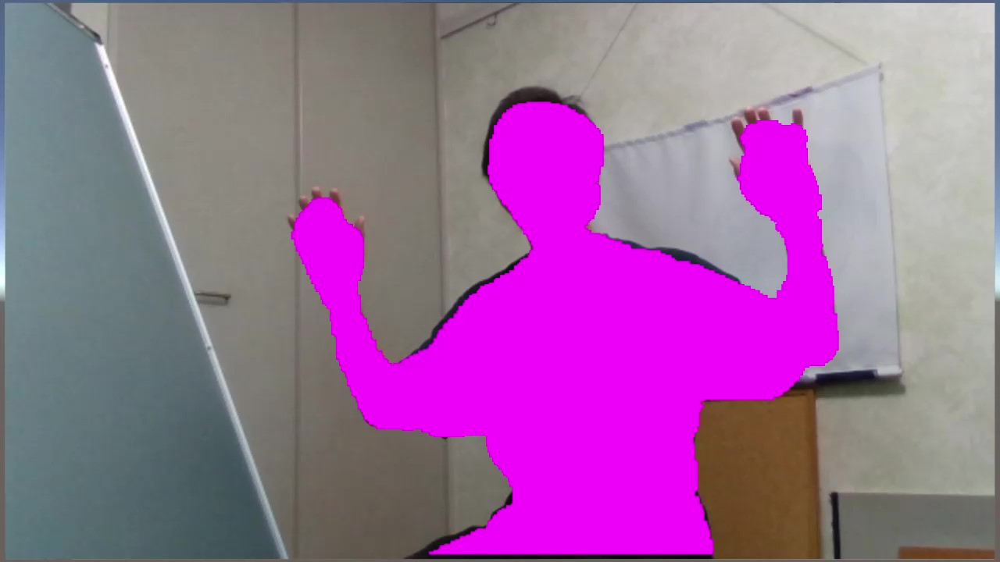

# User Segment Visualization with Nuitrack

[Watch on Youtube](https://youtu.be/gkiGkVpRQpg)



## Tested Environment
- Unity 2018.3.8f1
- Windows 10 Pro
- Intel RealSense D435/D435i
- Nuitrack 0.27.0 (Released : 2019-02-11)

## Requirements
- [Nuitrack (3D Skeleton Tracking Middleware)](https://nuitrack.com/)
- [NuitrackSDK.unitypackage](https://nuitrack.com/)

## Configuration of Nuitrack
C:\Program Files\Nuitrack\nuitrack\nuitrack\data\nutrack.config

- Set Depth2ColorRegistration to true for spatial alignment (default value is false)
```
    "DepthProvider": {
        "RotateAngle": "0", 
        "RGB": "Auto", 
        "Depth2ColorRegistration": true, 
        "Mirror": false
    }, 
```

- Set ProcessWidth and ProcessHeight to change resolution
```
    "Realsense2Module": {
        "Depth": {
            "ProcessMaxDepth": 5000, 
            "ProcessWidth": 1280, 
            "ProcessHeight": 720, 

            ......
        },

        ......

        "RGB": {
            "ProcessWidth": 1280, 
            "ProcessHeight": 720
        }
    },
```

## References
- [Nuitrack: User Segment Visualization](http://download.3divi.com/Nuitrack/doc/UnitySegment_page.html)
